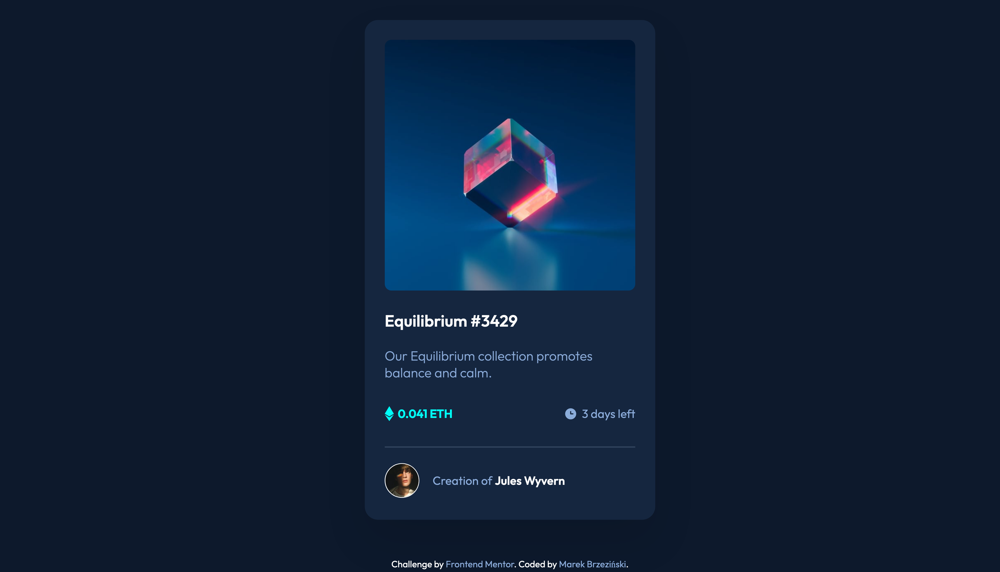

# Frontend Mentor - NFT preview card component solution

This is a solution to the [NFT preview card component challenge on Frontend Mentor](https://www.frontendmentor.io/challenges/nft-preview-card-component-SbdUL_w0U). Frontend Mentor challenges help you improve your coding skills by building realistic projects.

## Table of contents

- [Overview](#overview)
  - [Screenshot](#screenshot)
  - [Links](#links)
- [My process](#my-process)
  - [Built with](#built-with)
  - [What I learned](#what-i-learned)
  - [My questions](#my-questions)
- [Author](#author)

## Overview

### Screenshot

### Links

<!-- TODO -->

- [Link to the Git repository](https://github.com/marekbrze/Frontend-Mentor-NFT-Card)
- [Live Demo](https://marekbrze.github.io/Frontend-Mentor-NFT-Card/)

## My process

### Built with

Plain HTML & CSS.

### What I learned

- I used this challenge to optimize my workflow. Especially generating css variables in Figma and using them in the code.

### My questions

- How to make sure that hoverable overlay is accessible?
- Why does overlay takes expands outside of the image?

## Author

- Linkedin - [Marek Brzeziński](https://www.linkedin.com/in/marekbrzezinski/)
- Frontend Mentor - [@marekbrze](https://www.frontendmentor.io/profile/yourusername)
- Twitter - [@marekbrze](https://www.twitter.com/marekbrze)
